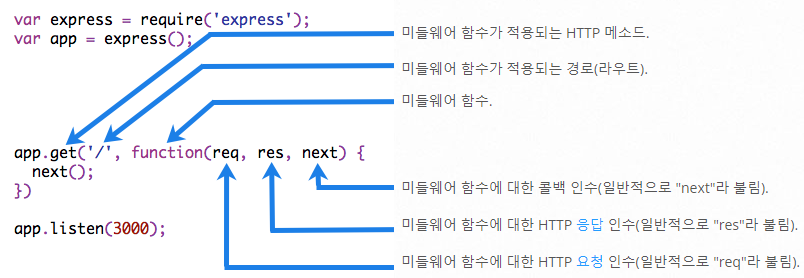

# Express_Framework_Study
## Express란?

<pre><code>Fast, unopinionated, minimalist web framework for Node.js           
                                        -Express Document</code></pre>
- Express는 대중적인 웹 프레임워크이다.

- Express는 미니멀한 프레임워크를 지향하고, 많은 미들웨어 패키지를 통해 뛰어난 확장성을 지니고 있다.

- Express는 Node의 핵심 모듈인 http와 Connect 컴포넌트를 기반으로 한다.
    - 하지만 4.x 버전 이후의 Express는 더 이상 Connect에 종속되지 않는다고 함.

## Express 기초 원리 
1. Express 서버를 시작하면 http 요청을 받을 수 있도록 대기한다.

2. http 요청이 들어오면 해당 요청에 맞는 미들웨어 함수가 동작한다. 

<pre><code>const express = require('express')
const app = express() // express 애플리케이션 선언
const port = 3000 // 포트를 지정한다

// 미들웨어 함수
app.get('/', (req, res) => {
    res.send('Hello World!')
})

// 지정한 포트에서 서버를 시작
app.listen(port, () => {  
console.log(`Example app listening on port ${port}`)
})</code></pre>

## Express 미들웨어

- Express에서 미들웨어란 http 요청과 응답 과정에서 필요한 처리를 담당하는 함수이다. ex. /hello로 GET 요청이 들어오면 무슨 코드를 실행하고... 어떤 정보를 응답할지 정한다.

- 미들웨어는 요청 객체(req), 응답 객체(res), 그리고 다음 미들웨어 함수에 대한 참조(next)를 인자로 갖는다.

- 미들웨어 함수는 다음과 같은 태스크를 수행할 수 있다.
    - 미들웨어 함수 내 코드 실행
    - 요청 및 응답 객체 변경
    - 요청-응답 주기를 종료
    - 다음 미들웨어 함수를 호출

- 미들웨어 함수 예시
<pre><code>app.get('/', (req, res, next) => {
  next() // 다음 미들웨어 함수를 작동
})</code></pre>

### 대표적인 Express 미들웨어 모듈
| 미들웨어 모듈          | 설명                                           | 내장 함수                  |
| ----------------------- | ---------------------------------------------- | ------------------------- |
| body-parser             | HTTP 요청 body를 파싱합니다.                  | `express.bodyParser`      |
| compression             | HTTP 요청들을 압축합니다.                     | `express.compress`        |
| connect-rid             | 고유한 요청 ID를 생성합니다.                  | 없음                      |
| cookie-parser           | 쿠키 헤더를 파싱하고 req.cookies에 할당합니다. | `express.cookieParser`    |
| cookie-session          | 쿠키 기반의 세션을 만듭니다.                  | `express.cookieSession`   |
| cors                    | 다양한 옵션들을 이용하여 Cross-origin resource sharing (CORS)를 활성화합니다. | 없음 |
| csurf                   | CSRF 취약점을 방어합니다.                      | `express.csrf`            |
| errorhandler            | 개발 중에 발생하는 에러를 핸들링하고 디버깅합니다. | `express.errorHandler`    |
| method-override         | 헤더를 이용해 HTTP method를 덮어씁니다.       | `express.methodOverride` |
| morgan                  | HTTP 요청 로그를 남깁니다.                    | `express.logger`          |
| multer                  | multi-part 폼 데이터를 처리합니다.             | `express.bodyParser`      |
| response-time           | 응답 시간을 기록합니다.                       | `express.responseTime`    |
| serve-favicon           | 파비콘을 제공합니다.                           | `express.favicon`         |
| serve-index             | 주어진 경로의 디렉토리 리스트를 제공합니다.    | `express.directory`       |
| serve-static            | 정적 파일을 제공합니다.                        | `express.static`          |
| session                 | 서버 기반의 세션을 만듭니다 (개발 전용).       | `express.session`         |
| timeout                 | HTTP 요청 처리를 위해 timeout을 만듭니다.      | `express.timeout`         |
| vhost                   | 가상 도메인을 만듭니다.                        | `express.vhost`           |

## Express 라우터(Router)
- Express는 쉽게 라우터를 분리하여 깔끔하게 라우팅을 관리할 수 있도록 편의를 제공해준다. -> Router

### Router의 사용 예시
<pre><code>//디렉토리 구조
.
├── routes
│   └── hello.js
└── app.js</code></pre>
위와 같은 디렉토리 구조라고 할 때

<pre><code>// ./routes/hello.js 
import Express from "express";

const router = Express.Router();

router.get('/', (req,res) => {
    res.send('hello,wolrd')
})

router.get('/hi', (req,res) => {
    res.send('hi')
}) // 해당 라우팅함수는 /hello/hi에 위치하게 된다. 

export default router;
</code></pre>
해당 파일에서 라우팅 함수/미들웨어 함수를 사용하고, app.js 파일에서 hello.js 파일을 불러와 동일하게 작동하도록 사용할 수 있다.

<pre><code>// app.js

import Express from "express";
import hello from './routes/hello.js' // hello.js 파일에 등록된 라우팅함수들을 불러옴

const app = Express()
const port = 8080

app.use('/hello', hello) // /hello 경로에 미들웨어를 장착함

app.get('/', (req, res) => {
  res.json({
    message : "Hello, World!"
  })
})

app.listen(port, () => {
  console.log(`http://localhost:${port}`)
})</code></pre>

## 참고문서
- https://expressjs.com/ko/
- https://developer.mozilla.org/ko/docs/Learn/Server-side/Express_Nodejs
- https://wikibook.co.kr/article/what-is-expressjs/
- https://inpa.tistory.com/entry/EXPRESS-%F0%9F%93%9A-%EB%AF%B8%EB%93%A4%EC%9B%A8%EC%96%B4-%F0%9F%92%AF-%EC%9D%B4%ED%95%B4-%EC%A0%95%EB%A6%AC