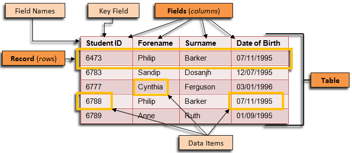
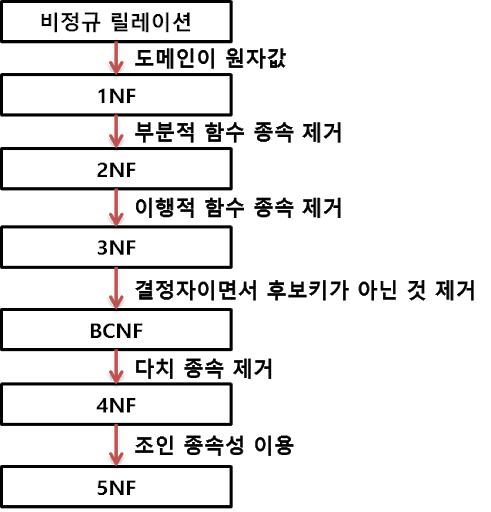
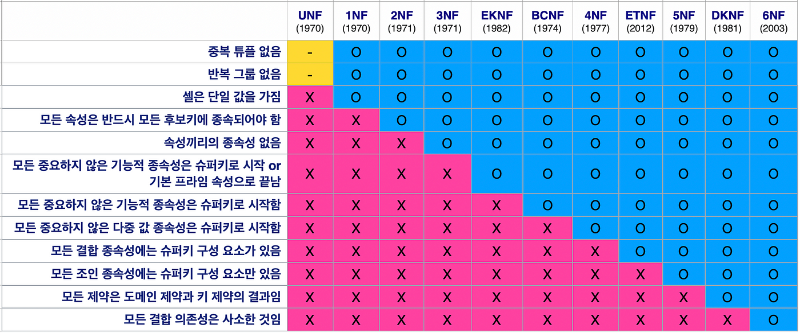

# RDBMS_MySQL_study

## RDB란?

    RDB란 관계형 데이터베이스라는 뜻으로 데이터를 테이블에 직관적으로 간단하게 나타내는 데이터베이스 형식이다.

- 대표적인 RDBMS ex.) OracleDB, MySQL, mariaDB

## 정규화(Normalization)

 

    관계형 데이터베이스의 설계에서 중복을 최소화하게 데이터를 구조화하는 프로세스

- 정규화를 통해 불필요한 데이터를 제거 -> DB 용량 최소화 
- 데이터의 저장을 논리적으로, 이상현상 방지 -> 무결성 유지

### 이상현상
- 삽입 이상(Insertion Anomaly) : 데이터를 삽입하기 위해 불필요한 데이터도 함께 삽입해야 하는 현상

- 삭제 이상(Deletion Anomaly) : 어떤 데이터를 삭제하면, 의도하지 않은 다른 데이터까지 삭제되어버리는 현상

- 갱신 이상(Update Anomaly) : 중복된 데이터 중 일부만 수정되어 데이터 모순이 일어나는 현상

### 함수 종속성

    어떤 테이블의 속성 A와 B에 대하여, A값에 의해 B값이 유일하게 정해지는 관계를 말하며, "B는 A에 함수 종속이다"라고 한다. A→B의 기호로 나타낸다. 
    이때, A를 결정자(Determinant)라고 하고, B를 종속자(Dependant)라고 한다. 

- 완전 함수 종속 : 종속자가 기본키에만 종속되며, 기본키가 여러 속성으로 구성되어 있을경우 기본키를 구성하는 모든 속성이 포함된 기본키의 부분집합에 종속된 경우

- 부분 함수 종속 : 종속자가 기본키가 아닌 다른 속성에 종속되거나, 기본 복합키의 구성요소 중 일부만 종속된 경우 

- 이행 함수 종속 : X, Y, Z라는 3 개의 속성이 있을 때 X→Y, Y→Z 이란 종속 관계가 있을 경우, X→Z가 성립될 경우

- 결정자 함수 종속 : 함수 종속의 결정자가 후보키가 아닌 경우.

- 다중값 종속(다치 종속) : 한 릴레이션에서 둘 이상의 독립적인 다중값 속성이 존재하는 경우.

- 조인(결합) 종속 : 릴레이션을 둘로 나눌 때는 원래의 릴레이션으로 회복할 수 없으나, 그 이상으로 분리할 경우 원래의 릴레이션으로 복원이 가능한 경우.

### 제 1정규화 (1NF)
- 테이블의 컬럼이 원자값(Atomic Value, 하나의 값)을 갖도록 테이블을 분해하는 것

- 다음과 같은 규칙을 만족해야한다.
    1. 각 컬럼이 하나의 속성만을 가져야한다.
    2. 하나의 컬럼은 같은 종류나 타입(type)의 값을 가져야 한다.
    3. 각 컬럼이 유일한(unique) 이름을 가져야 한다.
    4. 컬럼의 순서가 상관없어야 한다.

### 제 2정규화 (2NF)
- 제 1정규형을 만족한 상태
- 부분 함수 종속을 제거한다. -> 완전 함수 종속을 만족해야한다.

### 제 3정규화 (3NF)
- 제 2정규형을 만족한 상태
- 이행 함수 종속을 제거한다.

### 보이스-코드 정규화 (BCNF, Boyce-codd Normal Form)
- 제 3정규형을 만족한 상태
- 모든 결정자가 후보키 집합에 속해야한다.

### 제 4정규화
- BCNF를 만족한 상태
- 다중값 종속(다치 종속)이 없어야한다.

### 제 5정규화
- 제 4정규형을 만족한 상태
- 더 이상 비손실 분해를 할 수 없어야한다.

## 트랜잭션(Transaction)

    데이터베이스의 상태를 변화시키기 해서 수행하는 작업의 단위

- 트랜잭션의 특징

    - 원자성(Atomicity)
        - 트랜잭션의 연산은 데이터베이스에 모두 반영되든지 아니면 전혀 반영되지 않아야 한다.

        - 트랜잭션 내의 모든 명령은 반드시 완벽히 수행되어야 하며, 모두가 완벽히 수행되지 않고 어느하나라도 오류가 발생하면 트랜잭션 전부가 취소되어야 한다.

    - 일관성(Consistency)
        - 트랜잭션이 그 실행을 성공적으로 완료하면 언제나 일관성 있는 데이터베이스 상태로 변환한다.

        - 시스템이 가지고 있는 고정요소는 트랜잭션 수행 전과 트랜잭션 수행 완료 후의 상태가 같아야 한다.
    
    - 독립성(Isolation)
        - 둘 이상의 트랜잭션이 동시에 병행 실행되는 경우 어느 하나의 트랜잭션 실행중에 다른 트랜잭션의 연산이 끼어들 수 없다.

        - 수행중인 트랜잭션은 완전히 완료될 때까지 다른 트랜잭션에서 수행 결과를 참조할 수 없다.
    
    - 영속성(Durablility)
        - 성공적으로 완료된 트랜잭션의 결과는 영구적으로 반영되어야 한다.

- 트랜잭션의 연산
    - Commit : 하나의 트랜잭션에 대한 작업이 성공적으로 끝났고, 데이터베이스가 일관된 상태일 때 트랜잭션이 마무리됐음을 알려주는 연산
    
    - Rollback : 하나의 트랜잭션이 비정상적으로 처리되어 데이터베이스에 이상을 가할 때, 해당 트랜잭션을 취소 후 트랜잭션을 재시작하거나 트랜잭션이 행한 모든 연산을 취소하는 연산

- 트랜잭션의 상태
    - 활동(Active) : 트랜잭션이 실행중인 상태

    - 실패(Failed) : 트랜잭션 실행에 오류가 발생하여 중단된 상태

    - 철회(Aborted) : 트랜잭션이 비정상적으로 종료되어 Rollback 연산을 수행한 상태

    - 부분 완료(Partially Committed) : 트랜잭션의 마지막 연산까지 실행했지만, Commit 연산이 실행되기 직전의 상태

    - 완료(Committed) : 트랜잭션이 성공적으로 종료되어 Commit 연산을 실행한 후의 상태

## MySQL_DDL문(Data Definition Language)

    DDL은 데이터 정의 언어로 테이블의 구조나 관계를 생성하는데 사용된다.

### CREATE 
- 테이블을 생성하거나 데이터베이스를 생성하는 명령어
<pre><code>// 데이터베이스 생성
CREATE DATABASE 데이터베이스명

CREATE TABLE 테이블명(
    컬럼명 데이터타입,
    ...
)
</code></pre>

#### 데이터타입
| 타입         | 크기                    | 데이터                   |
|--------------|-------------------------|--------------------------|
| bool, boolean| 1 Byte                  | 참 / 거짓                |
| tinyint      | 1 Byte                  | 정수                     |
| smallint     | 2 Byte                  | 정수                     |
| mediumint    | 3 Byte                  | 정수                     |
| int, integer | 4 Byte                  | 정수                     |
| bigint       | 8 Byte                  | 정수                     |
| float        | 4 Byte                  | 부동소수점(실수)         |
| double       | 8 Byte                  | 부동소수점(실수)         |
| bit(n)       | (n) Bit                 | 정수                     |
| char(n)      | (n) Byte 고정형, 최대 2^8 Byte | 문자           |
| varchar(n)   | (n) Byte 가변형, 최대 2^8 Byte | 문자           |
| tinytext     | 2^8 Byte                | 문자                     |
| text         | 2^16 Byte               | 문자                     |
| mediumtext   | 2^24 Byte               | 문자                     |
| longtext     | 2^32 Byte               | 문자                     | 
| date         |                         | YYYY-MM-DD               |
| time         |                         | HH:MM:SS                 |
| datetime     |                         | YYYY-MM-DD HH:MM:SS      |
| timestamp    |                         | YYYY-MM-DD HH:MM:SS      |
| year         |                         | YYYY                     |
| ENUM         | 최대 65535 개의 다른 값  | 문자 or NULL              |
| SET          | 최대 64 개의 다른 값     | 문자 or NULL              |

### DROP
- 테이블이나 데이터베이스를 삭제하는 명령어
<pre><code>DROP TABLE 테이블명;</code></pre>

### TRUNCATE
- 테이블에서 데이터를 삭제하는 명령어
<pre><code>TRUNCATE TABLE 테이블명;</code></pre>

### ALTER
- 테이블에서 데이터베이스의 객체를 변경하는 명령어
<pre><code>// 컬럼 추가
ALTER TABLE 테이블명 ADD 추가할컬럼 데이터타입; 

// 컬럼 타입 수정
ALTER TABLE 테이블명 MODIFY 변경할컬럼 변경할타입;

// 컬럼명 수정
ALTER TABLE 테이블명 CHANGE 기존컬럼명 변경할컬럼명;

// 컬럼 삭제
ALTER TABLE 테이블명 DROP 컬럼명;</code></pre>

## MySQL_제약조건(Constraint)
    제약조건이란 데이터의 무결성을 지키기 위해, 데이터를 입력받을 때 실행되는 검사 규칙을 의미한다.

### NOT NULL
- NULL 값을 저장할 수 없도록 하는 제약 조건
<pre><code>CREATE TABLE 테이블명
(
    컬럼명 데이터타입 NOT NULL,
)</code></pre>

### UNIQUE
- 중복되는 값을 저장할 수 없도록 하는 제약 조건
<pre><code>1. CREATE TABLE 테이블명
(
    컬럼명 데이터타입 UNIQUE,
    ...
)
 
2. CREATE TABLE 테이블명
(
    컬럼명 데이터타입,
    ...,
    [CONSTRAINT 제약조건명칭] UNIQUE (컬럼명)
)</code></pre>

### PRIMARY KEY(기본 키)
- NULL 값을 저장할 수 없다.
- 중복되는 값을 저장할 수 없다.
- 테이블에서 기본 키는 단 하나만 존재함 -> 복합 키로 컬럼을 여러 개 묶어서 사용할 수 있음. 단 복합 기본 키가 되는 컬럼들은 모두 위 규칙을 지켜야함.
<pre><code>1. CREATE TABLE 테이블명
(
    컬럼명 데이터타입 PRIMARY KEY,
    ...
)
 
2. CREATE TABLE 테이블명
(
    컬럼명 데이터타입,
    ...,
    [CONSTRAINT 제약조건명칭] PRIMARY KEY (컬럼명)
)</code></pre>

### FOREIGN KEY(외래 키)
- 테이블과 테이블을 연결해주는 역할을 갖는 키
<pre><code>CREATE TABLE 테이블명
(
    컬럼명 데이터타입,
    ...,
    [CONSTRAINT 제약조건명칭]
    FOREIGN KEY (컬럼명)
    REFERENCES 테이블명 (컬럼명)
)</code></pre>
#### ON DELETE와 ON UPDATE
- ON DELETE : 참조되는 테이블의 값이 삭제될 경우의 동작 설정
- ON UPDATE : 참조되는 테이블의 값이 수정될 경우의 동작 설정
    - CASCADE : 참조되는 테이블에서 데이터를 삭제/수정 시 참조하는 테이블에서도 삭제/수정이 같이 이루어짐
    - SET NULL : 참조되는 테이블에서 데이터를 삭제/수정 시 참조하는 테이블의 데이터는 NULL로 변경
    - NO ACTION : 참조되는 테이블에서 데이터를 삭제/수정 시 참조하는 테이블의 데이터 변경X
    - SET DEFAULT : 참조되는 테이블에서 데이터를 삭제/수정 시 참조하는 테이블의 데이터는 필드의 기본값으로 설정
    - RESTRICT : 참조하는 테이블에 데이터가 존재하면 참조되는 테이블의 데이터를 삭제/수정 불가
<pre><code>CREATE TABLE 테이블명
(
    컬럼 데이터타입,
    ...,
    [CONSTRAINT 제약조건명칭]
    FOREIGN KEY (컬럼명)
    REFERENCES 테이블명(컬럼명) [ON UPDATE/DELETE] 동작
);</code></pre>

### DEFAULT
- 해당 필드의 기본값을 설정 -> 해당 필드의 값을 입력하지 않으면 기본값으로 대체함
<pre><code>CREATE TABLE 테이블명
(
    컬럼명 데이터타입 DEFAULT 기본값,
    ...
)</code></pre>

## MySQL_DML문(Data Manipulation Language)

    DML은 테이블에 데이터 검색, 등록, 수정, 삭제하는 데 사용한다.

### SELECT
- 테이블 데이터 조회 명령어
<pre><code>SELECT 컬럼명 FROM 테이블명 [WHERE 조건]</code></pre>

### INSERT
- 테이블 데이터 등록 명령어
<pre><code>// 특정 컬럼에만 데이터 삽입
INSERT INTO 테이블명(컬럼명, 컬럼명, ...) VALUES(데이터값, 데이터값2, ...)

// 테이블 스키마와 같은 순서대로 값 삽입
INSERT INTO 테이블명 VALUES(데이터값, 데이터값2, ...)
</code></pre>

### UPDATE
- 테이블 데이터 수정 명령어 
<pre><code>UPDATE 테이블명 SET 컬럼명 = 데이터값, ... WHERE 조건</code></pre>

### DELETE
- 테이블 데이터 삭제 명령어
<pre><code>// 조건에 부합하는 컬럼 삭제
DELETE FROM 테이블명 WHERE 조건

// 전체 컬럼 삭제
DELETE FROM 테이블명 </code></pre>

## 참고문서

- https://ko.wikipedia.org/wiki/%EB%8D%B0%EC%9D%B4%ED%84%B0%EB%B2%A0%EC%9D%B4%EC%8A%A4_%EC%A0%95%EA%B7%9C%ED%99%94
- https://rebro.kr/159
- https://velog.io/@busybean3/%EB%8D%B0%EC%9D%B4%ED%84%B0%EB%B2%A0%EC%9D%B4%EC%8A%A4-%ED%95%A8%EC%88%98-%EC%A2%85%EC%86%8D%EC%84%B1Functional-Dependency
- https://developer111.tistory.com/8
- https://www.oracle.com/kr/database/what-is-a-relational-database/
- http://www.tcpschool.com/mysql/intro
- https://ssd0908.tistory.com/entry/MySQL-DDL-DML-DCL-%EB%AA%85%EB%A0%B9%EC%96%B4
- https://ozofweird.tistory.com/entry/MySQL-SQL
- https://yssa.tistory.com/entry/Database-%ED%95%A8%EC%88%98-%EC%A2%85%EC%86%8D%EC%84%B1Functional-Dependency%EA%B3%BC-%EC%A0%95%EA%B7%9C%ED%99%94Normalization
- https://velog.io/@wisdom-one/%EC%A0%95%EA%B7%9C%ED%99%94Normalization