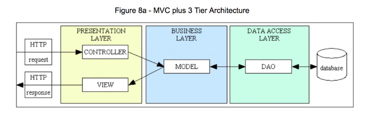

# 3-tier-Architecture_study

## 3-tier-Architecture (3계층구조)

    3계층으로 나누어 별도의 논리적/물리적으로 시스템을 구성하는 것

- Good
    - 각 계층이 분리되어 있다 -> 분업 효율이 좋다.

    - 각자의 계층이 여러 대의 서버로 나누어 동작함으로 서버의 부하를 줄인다.

- Bad
    - 1계층으로 구성한 것 보다 많은 관리가 필요하다.
    
    - 낮은 단계의 계층보다 비용 이슈

### Presentation Tier

- 사용자가 직접 마주하게 되는 계층 -> 따라서 주로 사용자 인터페이스를 지원함

- 사용자 인터페이스와 관계 없는 로직 등을 포함하지 않음

- = WEB Server, GUI, Front-end, WEB Layer 등 ...

- 주로 HTML, CSS, JS, 여타 사용자 인터페이스를 구성하는 것들이 해당됨

### Logic Tier

- 요청되는 정보를 로직을 바탕으로 처리하고 가공하는 것을 담당함

- 첫 번째 계층(Client)에서 이 계층을 바라볼 땐 서버처럼 동작함 (응답)

- 세 번째 계층(Database)에서 이 계층을 바라볼 떈 클라이언트처럼 동작함 (요청)

- = Application Layer, Business Layer, Service Layer, Back-end, WAS, Transaction Tier 등 ...   

- 주로 Node, Java, PHP, 여타 로직을 구성하고 미들웨어의 역할을 할 수 있는 것들이 해당됨

### Data Tier

- 데이터베이스와 데이터베이스에 접근하여 데이터를 읽거나 쓰는 것을 관리하는 것까지 담당함

- 3계층 구조에서는 모든 통신이 Logic Tier를 통과함으로 Presentation Tier와 직접 통신을 할 수 없음

- = Repository Layer, Persistence Layer 등 ...

- 주로 RDBMS(MySQL, Oracle) 또는 NoSQL 데이터베이스(MongoDB) 등 정보를 저장, 관리가 가능한 것들이 해당됨

### DAO (Data Access Object)/DTO (Data Transfer Object)

- C++, Java 같은 객체 지향 프로그래밍(OOP) 언어 환경에서 주로 사용한다.

- DAO
    - DB의 데이터에 접근하기 위한 객체이다.

    - DB에 접근하기 위한 로직을 분리하기 위해 사용한다.

    - 직접 DB에 접근하여 data를 삽입, 삭제, 조회 등 조작할 수 있는 기능을 수행한다.

- DTO
    - 계층 간의 데이터 교환을 위한 객체이다.

    - DTO 기법을 사용하면 중요한 정보를 노출시키지 않고 두 시스템(API와 서버 등) 간 통신을 원활하게 촉진할 수 있다.

## MVC와 3-Tier-Architecture

    "MVC패턴을 적용하였고 3tier 구조로 되어있는 프레임워크를 갖추고 있다"

- 위 사진은 3계층이 물리적으로 분리되어있고 이런 3-Tier-Architecture안에서 MVC Pattern적인 애플리케이션으로 통신중이라고 할 수 있다.

- MVC 'pattern'과 3-Tier-'Architecture'라는 두 개념은 소프트웨어를 정의하는 관점이 다르다.

### Software 'Achitecture'

- 소프트웨어 아키텍쳐는 프로그램에 있어 기초이자 근본이다.

- 소프트웨어의 구성요소들 사이에서 유기적 관계를 표현하고, 스프트웨어의 설계와 업그레이드를 통제하는 지침과 원칙
    - 3-tier-Architecture를 예로 들어 3-tier-Architecture는 3계층의 '물리적으로
    독립된' 모듈로 개발하고 유지하는 구조를 띈다.

### Disign 'Pattern'

-  SW 설계에 직면한 다양한 문제들을 효율적으로 해결할 수 있는 방법들을 유형별로 패턴화 한 것이다.

- 물리적으로 구분할 수 없는 설계를 문서화 하면서 고안된 방법이다.
    - MVC Pattern을 예로 들어 MVC Pattern은 [모델 - 뷰 - 컨트롤러]로 분리된 애플리케이션으로 물리적으로 구분할 수 없다. 

## 참고문서
- https://velog.io/@leesomyoung/MVC-%ED%8C%A8%ED%84%B4-vs-3-tier-architecture
- https://www.stevenjlee.net/2020/05/08/%EC%9D%B4%ED%95%B4%ED%95%98%EA%B8%B0-3%EA%B3%84%EC%B8%B5-%EA%B5%AC%EC%A1%B0-3-tier-architecture/
- https://www.ibm.com/kr-ko/topics/three-tier-architecture
- https://velog.io/@jhp1115/3-tier-Layered-Architecture%EC%99%80-MVC
- https://www.okta.com/kr/identity-101/dto/
- https://medium.com/msolo021015/dto-data-transfer-object-%EC%97%90-%EB%8C%80%ED%95%B4-fbbd8b472c2b
- https://4ngeunlee.tistory.com/235