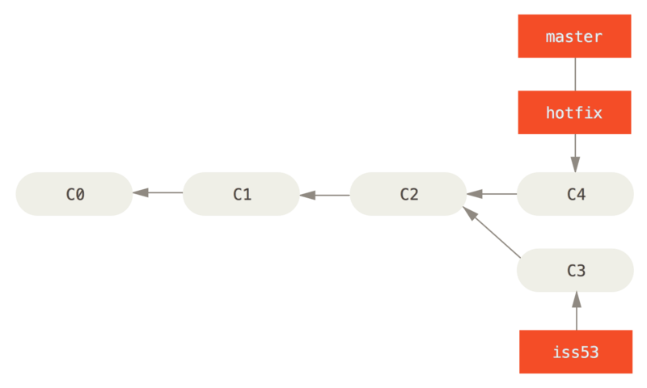
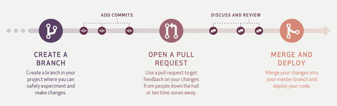

# git branch_study

## git?

    Git is a free and open source distributed version control system
                                                        - git-scm.com

- git은 컴퓨터 파일의 변경사항을 추적하고 여러 명의 사용자들 간에 해당 파일들의 작업을 조율하기 위한 스냅샷 스트림 기반의 분산 버전 관리 시스템(= 형상 관리 도구) 이다.
    
    - 스냅샷 방식 : 변동이 생긴 파일 전체를 저장
        1. 스냅샷 방식의 버전 관리 시스템에서 100번 수정했을 때 ( GIT ... )
        2. 50번째 수정 파일을 보고 싶다.
        3. 50번째 수정 파일을 부른다. -> 빠르다.
        4. 51번째를 보고싶으면? 51번째 수정 파일을 부른다.
    
    - 델타 방식 : 변경사항만 저장
        1. 델타 방식의 버전 관리 시스템에서 100번 수정됐을 때 ( CVS, SVN ... )
        2. 50번째 수정 파일을 보고 싶다. 
        3. 1~50번까지의 수정을 연산해 반영한 50번째 파일 상태를 보여줌 -> 너무 오래 걸린다.
        4. 51번째를 보고싶으면? -> 1~51번까지 연산을 다시한다.

- 멋지다 리누스 토르발스!

## git에서 branch란?

    개발을 하다 보면 코드를 여러 개로 복사해야 하는 일이 자주 생긴다. 
    코드를 통째로 복사하고 나서 원래 코드와는 상관없이 독립적으로 개발을 진행할 수 있는데, 이렇게 독립적으로 개발하는 것이 브랜치다.        
                                                                - git docs

- 순식간에 브랜치를 새로 만들고 브랜치 사이를 이동할 수 있다. 

- git은 branch를 만들어 작업 후 Merge 하는 방법을 권장한다.

- git의 branch를 통해 두 사람 이상이 협업하면서 병렬로 작업할 수 있다.

### git branch 

1. testing이라는 새로운 브랜치를 생성했을 경우 기본적으로 git이 생성하는 master 브랜치와 같은 커밋을 바라본다.
    - git에는 HEAD라는 특수한 포인터가 있다. 이 포인터는 지금 작업하는 브랜치를 바라본다. git branch 명령어는 브랜치를 생성만하지 현재 자신의 브랜치를 옮기지 않는다.   
<pre><code>git branch [branch_name] </code></pre>

2. 브랜치를 만들었다면 master 브랜치에서 새로 생성한 브랜치인 testing 브랜치로 옮길 수 있다.
    - git checkout 명령어를 통해 HEAD가 바라보는 브랜치를 testing 브랜치로 옮길 수 있다.
<pre><code>git checkout [branch_name] </code></pre>

3. HEAD가 가리키는 브랜치를 testing으로 옮긴 상황에서 커밋을 하면?
    - testing 브랜치는 제일 최신 커밋인 87ab2를 바라본다. 
    - master 브랜치는 testing 브랜치가 바라보는 커밋이 아닌 master 브랜치만이 가리키는 커밋인 f30ab를 바라본다.
<pre><code>git commit -m "message" </code></pre>

4. 3단계에서 다시 HEAD가 바라보는 브랜치를 master로 옮긴다면?
    - testing 브랜치가 바라보는 커밋은 그대로 존재한 채로 master 브랜치로 이동한다
    - testing 브랜치가 바라보는 커밋은 그대로 존재한 채로 이전 버젼의 커밋을 불러오는 것과 같은 행위다.
<pre><code>git checkout [branch_name] </code></pre>

5. HEAD가 가리키는 브랜치를 master로 되돌린 상황에서 커밋을 하면?
    - 프로젝트의 히스토리는 분리되어 진행된다.(갈라지는 브랜치)
    - 두 개의 작업 내용은 서로 독립적으로 각 브랜치에 존재한다.
<pre><code>git commit -m "message" </code></pre>

### git merge : fast-forward

1. 협업 중에 이슈가 발생하여 해당 이슈를 처리할 수 있는 브랜치를 하나 생성했다. (53번쨰 이슈라고 생각하고 브랜치명을 iss53이라 칭하자)
    - 그리고 iss53에서 일처리 후 커밋이 발생했다.
<pre><code>git checkout -b iss53 // 아래 두 줄과 같음
// git branch iss53
// git checkout iss53</code></pre>

2. 그러던 도중 master 브랜치에서 치명적인 에러가 발생해서 급하게 고쳐야하는 이슈가 생겼다!
    - master 브랜치로 돌아가 hotfix라는 새로운 브랜치를 생성하고 이슈를 고쳐 새롭게 커밋했다.
<pre><code>git checkout master
git checkout -b hotfix</code></pre>

3. hotfix 브랜치에서 이슈를 모두 해결하여 이제 master 브랜치에서 hotfix 브랜치를 합쳐야한다(merge).
    - 이 경우 fast-forward 방식으로 merge를 한다.
    - hotfix 브랜치는 C2 커밋을 기반으로한 C4 커밋을 바라보고 있기 때문에 브랜치 포인터는 Merge 과정 없이 그저 최신 커밋으로 이동한다.
    - 그리고 hotfix 브랜치는 이제 master 브랜치와 완전히 같은 브랜치이니 삭제한다.
<pre><code>git checkout master
git merge hotfix
// Terminal
Updating f42c576..3a0874c
Fast-forward
 index.html | 2 ++
 1 file changed, 2 insertions(+)</code></pre>

### git merge : merge-commit

4. hotfix 브랜치를 merge한 이후 iss53 브랜치에서 작업을 마무리하여 iss53 브랜치를 merge해야 한다.
    - 그런데 iss53 브랜치가 가르키는 커밋의 조상커밋이 master와 다르다. 이 때, fast-forward 방식으로 merge하지 않는다.
<pre><code>git checkout master
git merge iss53
// Terminal
Merge made by the 'recursive' strategy.
index.html |    1 +
1 file changed, 1 insertion(+)</code></pre>

5. git은 각 브랜치가 가리키는 커밋 두개(C4, C5)와 공통의 조상 하나(처음 갈라진 C2)를 사용하여 3-way Merge를 한다.
    - 3-way Merge를 통해 별도의 커밋(C6)를 만들고 master 브랜치가 그 커밋을 바라보도록 이동한다. -> 이러한 커밋은 부모가 여러개가 된다.
    - 그리고 master에 merge된 iss53 브랜치는 삭제한다.

    

## git branch 전략이란?(git-flow vs github-flow)

    Git 브랜치를 효과적으로 관리하기 위한 워크플로우

- 만약 Git 브랜치 관리에 명확한 기준이 없다면? 아래와 같은 수많은 문제가 발생한다.
    - 어떤 목적으로 생성된 브랜치?
    - 어떤 커밋에서 분기된 브랜치?
    - 어떤 브랜치가 최신?
    - 어떤 브랜치에 병합을?
    - ... etc

### Git-Flow

 

- Git-Flow 전략에는 2가지의 부류 총 5가지 종류의 브랜치가 존재한다.
    - Main 브랜치 : 항상 유지되는 브랜치
        - master : 제품으로 출시될 수 있는 브랜치
        - develop : 다음 출시 버전을 개발하는 브랜치
    - Supporting 브랜치 : 일정 기간 동안만 유지되는 브랜치
        - feature : 기능을 개발하는 브랜치
        - release : 이번 출시 버전을 준비하는 브랜치
        - hotfix : 출시 버전에서 발생한 버그를 수정 하는 브랜치

- Good
    - 명시적으로 버전관리가 필요한 어플리케이션에서 유용하다.
    - ex.) 오픈소스 프로젝트, 모바일 어플리케이션 등

- Bad
    - 소프트웨어를 지속적으로 제공하는 프로젝트에서 적합하지 않다.
    - ex.) 웹 어플리케이션 등

#### master 브랜치

- 프로젝트 시작시 가장 먼저 생성되는 브랜치이다.

- 언제든지 출시 가능한 프로덕션 코드를 모아둔다.

- 배포된 각 버전을 Tag를 이용해 표시한다.

#### develop 브랜치

- master 브랜치로부터 생성되는 브랜치이다.

- 다음 버전 개발을 위한 코드를 모아두는 브랜치이다.

- 개발이 완료되면, master 브랜치로 merge한다.

#### Feature 브랜치

- develop 브랜치로부터 생성되는 브랜치이다.

- 하나의 기능을 개발하기 위한 브랜치이다.

- 기능 개발이 완료되면, develop 브랜치로 merge한다.

- merge할 때 fast-forward가 아닌 Merge Commit을 생성하여 merge한다. -> 히스토리가 특정 기능 단위로 묶이게 하기 위함

- 네이밍 룰 : feature/branch-name

#### Release 브랜치

- develop 브랜치로부터 생성되는 브랜치이다.

- 소프트웨어 배포를 준비하기 위한 브랜치이다.

- 소소한 데이터, 사소한 버그 등을 수정하는 브랜치이다. ex.) 버전 이름, 변수명 오타 등

- 배포 준비가 완료되었다면 master와 develop 브랜치에 둘 다 merge한다.
    - master 브랜치에 merge할 때 Tag를 이용한 버전 표시

- release 브랜치가 존재함으로써 배포 업무와 관련없는 인원은 병렬적으로 기능을 개발한다.

- 네이밍 룰 : release/v1.0

#### Hotfix 브랜치

- master 브랜치에서 생성되는 브랜치이다.

- 이미 배포된 버전(master 브랜치)에 발생한 문제를 해결하는 브랜치이다.

- 문제 해결이 완료되면 master와 develop 브랜치에 둘 다 merge한다.

- hotfix 브랜치가 존재함으로써 핫픽스 업무와 관련없는 인원은 병렬적으로 기능을 개발한다.

- 네이밍 룰 : hotfix/v1.0.1

### Github-Flow

- Github-Flow 전략에는 2가지 종류의 브랜치가 존재한다.
    - master 브랜치 : 항상 유지되는 stable한 브랜치
        - 언제든지 배포가 가능해야한다.

        - 새로운 기능개발은 master를 기반으로 별도 브랜치를 생성하여 작업한다.
        
        - 코드를 merge하기 전 pull request를 만든다.

        - 코드리뷰 후 pull request를 master 브랜치에 merge한다.
        
        - merge된 master 브랜치는 즉시 배포할 수 있어야한다. => stable 해야함
    
    - topic 브랜치 : 새로운 기능을 개발하기 위한 브랜치
        
        - master 브랜치로부터 생성된다.
        
        - hotfix와 같은 버그 수정도 topic 브랜치에서 진행한다.

        - 기능이 완성되지 않아도 꾸준히 push 한다. -> 분실, 고장등 예상치 못한 이슈로 인한 코드의 유실을 막기 위함 + 구성원 모두가 끊임없이 커뮤니케이션

        - 네이밍 룰 : 기능을 설명하는 명확한 이름

- Good
    - 단일 릴리즈 버전만 존재하는 어플리케이션
    - ex.) 웹 어플리케이션 등

- Bad
    - 명시적으로 버전을 관리해야하는 어플리케이션
    - ex.) 오픈소스 프로젝트, 모바일 어플리케이션 등  

# 참고문서

- https://git-scm.com/book/ko/v2/Git-%EB%B8%8C%EB%9E%9C%EC%B9%98-%EB%B8%8C%EB%9E%9C%EC%B9%98%EB%9E%80-%EB%AC%B4%EC%97%87%EC%9D%B8%EA%B0%80
- https://nozeroslope.tistory.com/192?category=1033491
- https://hudi.blog/git-branch-strategy/
- https://techblog.woowahan.com/2553/
- https://hudi.blog/git-branch-strategy/
- https://blog.hwahae.co.kr/all/tech/9507