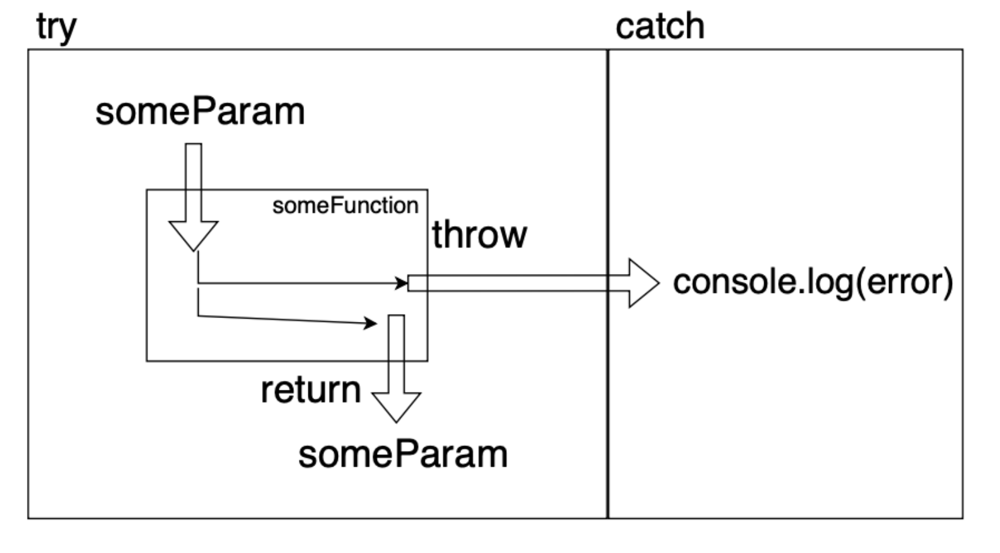

# NodeJS_study_02 : try..catch

## try..catch

    try {
        // code logic
    } catch (err) {
        // error handling
    } finally { // finally 구문은 필수가 아니다.
        // always execution
    }

- 노드에서 예외 처리는 굉장히 중요하다.
    - 예외 : 처리하지 못한 에러

    - 노드는 싱글스레드 기반임으로 에러로 인해 멈추면 프로세스 자체가 멈춘다. -> 서버 다운

- try..catch 구문은 런타임 에러에만 동작한다.
    - 실행 가능한(runnable) 코드에만 동작한다. -> syntax 에러에는 작동하지 않음

- try..catch 구문은 동기적으로 작동한다.
    - ‘스케줄 된(scheduled)’ 코드에서 발생한 예외는 try..catch에서 잡아낼 수 없다. = 비동기함수 못잡는다.

- ~~에러로 캐치볼하는 법 (던지고(throw) 잡는다(catch)).~~

### 동기 코드일 때 예외처리

    try {
        throw new Error('Test error')
    } catch(err) {
        console.error(err)
    }

- 동기적 코드의 경우 일반적으로 try..catch 구문으로 감싸주기만 하면 핸들링이 가능하다.

### 비동기 코드일 때 예외처리

    try {
        setTimeout(() => {
            try{
                throw new Error('Test Error')
            } catch (err) {
                console.error(err)
            }
        }, 1000)
    }
    catch (err) {
        console.error(err)
    }

- 비동기 코드일 때 예외처리를 하는 가장 간단한 방법은 비동기 함수 내부에서 try..catch 구문을 사용하는 것 이다.

### 모듈 자체에서 잡아주는 에러일 경우

    const fs = require('fs')

    // 에러가 발생해도 프로세스가 죽지 않음
    setInterval(() => {
        fs.unlink('./nofile.js', () => {
            console.log('hi') 
        }) 
    }, 1000)

    // 아래의 방법으로 에러 발생시 로그를 남길 수 있다.
    setInterval(() => {
        fs.unlink('./nofile.js', (err) => {
            if (err) {
                console.error(err)
            }
        })
    }, 1000)

- 위에 코드는 존재하지 않는 파일을 지우려고(unlink) 시도함으로 에러가 발생하지만 프로세스가 종료되진 않는다.

- 그럴 경우 에러가 발생할 시 기록하고 수정할 수 있도록 로그를 남겨두는게 좋다.

### 예측 불가능한 에러일 경우

    process.on('uncaughtException', (err) => {
        console.error('What happened???????', err)
        process.exit()
    })

    throw new Error('Test Error')
    

- 권장되는 방법은 아니다.
    - uncaughtException 이벤트가 발생해도 다음 동작이 제대로 수행되는지 알 수 없다.
    - 따라서 uncaughtException를 통해 단순히 에러 내용을 기록만하고 process.exit()를 통해 프로세스를 종료하는 방법을 권장한다.

## throw

    throw [error object]

- throw문은 사용자 정의 예외를 생성할 수 있다.

- JavaScript의 표준 에러 객체 관련 생성자를 지원해준다.
    - ex.) Error, SyntaxError, ReferenceError 등...

### 에러 객체

- 에러가 발생하면 JavaScript는 에러 상새내용이 담긴 객체를 생성한다.
    - 이후 throw문을 통해 catch에 가변인자로 err를 전달한다.

- 에러 객체는 다음과 같은 내용을 포함한다.
    - name : 에러 이름 ex.) ReferenceError, SyntaxError 등

    - message : 에러 상세 내용을 담고 있는 메시지 ex.) ReferenceError : [message]

    - stack : 현재 호출 스택. 에러를 유발한 중첩 호출들의 순서 정보를 가진 문자열

## finally

- 항상 실행되는 부분을 finally문을 통해 만들 수 있다.
    - finally는 try 케이스든 catch 케이스든 언제든지 실행한다.

## 참고문서

- https://ko.javascript.info/try-catch