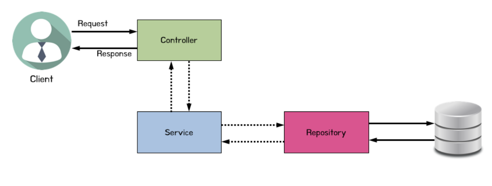
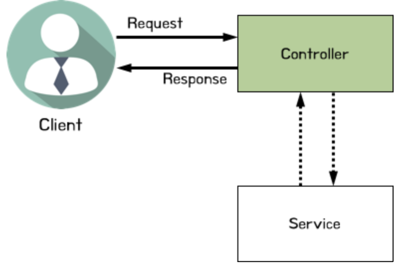
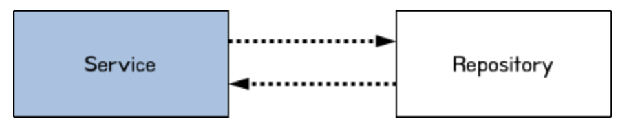

# 3-tier-Architecture_study_02

## Controller Layer

- Controller Layer에서는 주로 사용자의 요청의 진입점이다.

- Controller Layer에서 Service Layer로 어떤 요청이 들어왔는지 넘긴다.

- Service Layer에서 Business Logic을 바탕으로 처리한 내용을 다시 Controller Layer가 받고 사용자에게 응답한다.

## Service Layer

- Service Layer에서는 Controller Layer에서 온 요청을 받고 Business Logic을 바탕으로 요청을 처리한다.
    - 만약 이 과정에서 DB 정보가 필요할 경우 Repository Layer에 요청을 한다.

- Service Layer의 처리 결과를 Controller Layer로 전달한다.

### Business Logic (비즈니스 로직)

    프로그램의 핵심 로직. 어떻게 데이터가 처리되는지 정의한 것

- 보통 3-tier에서 가운데 계층 (Service Layer)에 위치한다.

- 비즈니스 로직은 다른 계층에 의존해서는 안된다.

- = 도메인 로직, 어플리케이션 로직

### Why? 'Business' Logic

    Business Logic에서 Business는 사업을 뜻하는게 아닌 'SW가 풀려고 하는 현실 세상의 문제'를 의미한다.

- Business Logic은 판단을 하는 코드다. 나머지 코드는 그 판단에 대한 결과를 보여주거나 판단에 필요한 정보들을 가져오는 코드들이다.

- 보편적으로 현실 문제에 대한 __판단__ 을 하였는가?를 중점으로 Business Logic인지를 판단한다.
    - ex1.)
        - 현실의 문제 : 옷을 사고 싶다. 
        - NO : 옷 관련 정보들을 가져온다.
        - YES : 옷 가격만큼의 돈과 결제수단을 보유하고 있나? -> 판단
        - YES : 사용자가 옷을 샀다면? -> 사용자가 가지고 있는 돈에서 가격만큼 뺀다. -> 판단
        - YES : 사용자가 옷을 안산다면? -> 사용자가 가지고 있는 돈을 그대로 냅둔다. -> 판단
        - NO : 보유하고 있지 않다면 사용자에게 살 수 없다고 알리고, 있다면 살 수 있다고 알린다.
        
    - ex2.)
        - 현실의 문제 : 호텔방을 예약하고 싶다.
        - NO : 호텔 에약 현황을 가져온다.
        - YES : 예약 가능한 호텔방이 존재한가? -> 판단
        - NO : 존재하지 않는다면 사용자에게 예약할 수 없다고 알리고, 없다면 할 수 있다고 알린다.

## Repository Layer

- Repository Layer는 DB를 관리하고 CRUD 작업을 수행한다.

- Service Layer에 요청에 따라 DB 작업을 수행하고 응답한다.

## 참고문서

- https://medium.com/@su_bak/term-business-logic%EC%9D%B4%EB%9E%80-6d53c4782d73

- https://velog.io/@eddy_song/domain-logic

- https://velog.io/@eddy_song/separation-of-concerns