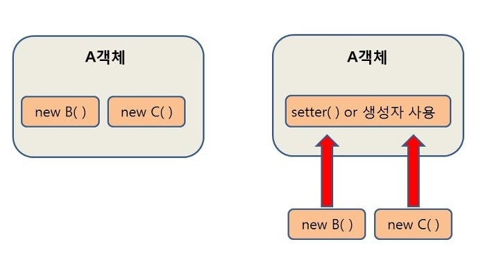
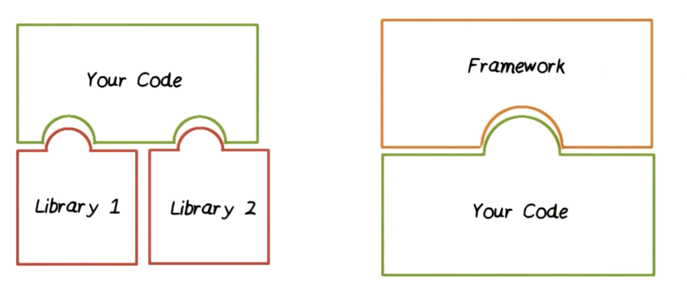
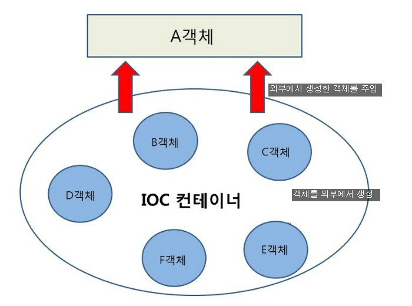

# DI(Dependency Injection) / IoC(Inversion of Control)

## DI(Dependency Injection / 의존성 주입)

    의존 관계를 외부에서 결정(주입)해주는 것, 런타임 시점에 결정하는 방식

- 의존성의 위험성을 해소하기 위해 사용되는 디자인 패턴이다.

### 의존성(Dependency)

- 의존성은 코드에서 두 모듈간의 연결 또는 관계를 의미한다.
    - 만약 클래스 B를 사용하는 A클래스가 있을 때 "의존대상 B가 변하면, 그것이 A에 영향을 미칠 것 이다."

- 의존성은 객체 간의 협력을 위해 필수적이다.

- 모듈과 모듈 사이의 의존성 강도 => 결합도(Coupling)

- 의존성이 강하면 생기는 문제가 많다.
    - 만약 A -> B -> C를 의존하는 상황에서 C가 변경된다면? A B C 클래스 모두를 변경해야할지도 모른다.
    - 모듈 재사용을 어렵게 만든다.
    - 특정 모듈 별로 독립적으로 테스트하는 유닛 테스트가 어렵다.

### Why use DI?

- 모듈 간 의존성을 줄여 높은 의존성을 보일 때 생기는 문제들을 방지할 수 있다.

- 변경에 민감해지지 않는다.

- 모듈 재사용성을 높혀준다. 

- 유닛 테스트를 쉽게 만들어준다.

### 생성자 주입

    class computer {
        constructor(cpu) {
            this.cpu = cpu
        }
    }

- 생성자를 통해 의존 관계를 주입하는 방법

- 생성자의 호출 시점에 1회 호출 되는 것이 보장된다.

- 주입받은 객체가 변하지 않거나, 반드시 객체의 주입이 필요한 경우에 강제하기 위해 사용한다.

### 메소드 주입

    class computer { 
        //...
        set_gpu(gpu){
            this.gpu = gpu
        }
    }

- 주입받는 객체가 변경될 가능성이 있는 경우 사용한다.

### 필드 주입 (DI가 적용되지 않는 방식) = Bad case

    class computer {
        constructor() {
            this.cpu = new cpu()
        }   
    }

- 컴파일 하는 시점에 결정되는 의존성이다. ( 컴파일타임 의존성 )

- 외부에서 접근할 수 없는 방식이다.

- 클래스 간의 의존성을 갖는다.

## IoC(Inversion of Control / 제어의 역전)

    Don't call us, we will call you.
    - 헐리우드 원칙(Hollywood Principle)

- 개발자가 작성한 코드(객체나 메소드 등)의 흐름 제어를 개발자가 아니라 외부(프레임워크 등)에 위임하는 것 이다.
    - 즉 코드의 흐름 제어를 하는 주체가 개발자에서 프레임워크로 역전된다.

- 개발자가 코드의 흐름을 제어하지 않기 때문에 핵심 비즈니스 로직에 집중할 수 있다.

### IoC Container( in Nest.js )

    IoC 컨테이너는 객체의 등록, 관리, 생성 등을 책임지고, 의존성을 관리하는 컨테이너이다.

- Nest.js에서는 Providers를 IoC 컨테이너에서 관리하고, 의존성 주입을 받을 일이 생길 때 IoC 컨테이너에 등록된 Provider를 주입한다.
    - Providers : 다른 클래스에 의존성으로 주입될 수 있는 항목들이다.
        - ex.) service, repositories.. 등

#### example

1. @Injectable() 데코레이터 함수를 통해 Service라는 클래스를 IoC 컨테이너에 등록한다.
<pre><code>@Injectable()
export class Service {}</code></pre>

2. IoC 컨테이너에 등록한 Provider를 주입하기 위해 @Module() 데코레이터 함수에 Provider를 추가한다.
    - Nest.js는 Module 중심의 아키텍처를 사용하여 전체 어플리케이션을 구성하기 때문에
각 Module 별로 Provider를 캡슐화하고 서로 분리되어 관리해야하기 때문이다.
<pre><code>@Module({
  ...,
  providers: [Service],
})</code></pre>

3. 의존성 주입을 받을 모듈에서 IoC 컨테이너에 등록된 Provider를 사용한다.
    - Nest.js는 기본적으로 TS를 사용하기 때문에 service의 타입만 Service 클래스로 지정해줘도 IoC 컨테이너에서 의존성을 주입해준다.
<pre><code>export class Controller {
    constructor(service: Service) {}
    ...
}</code></pre> 

## 참고문서
- https://mangkyu.tistory.com/150
- https://mangkyu.tistory.com/125
- https://velog.io/@ashwon1218/DIDependency-injection-%EB%9E%80
- https://hudi.blog/dependency-injection/
- https://velog.io/@kon6443/NodeJS-DI-%EC%A0%81%EC%9A%A9-typedi-module-%EC%BB%A8%ED%85%8C%EC%9D%B4%EB%84%88-clean-architecture-%EA%B3%84%EC%B8%B5-%EB%B6%84%ED%95%A0%EA%B3%BC%EC%A0%95-%EB%B0%8F-code-refactoring
- https://june0122.tistory.com/18
- https://oneul-losnue.tistory.com/364
- https://hudi.blog/inversion-of-control/
- https://any-ting.tistory.com/141
- https://hou27.tistory.com/entry/NestJS-Provider%EC%99%80-Nest-IoC-Container
- https://medium.com/zigbang/spring-%EA%B0%9C%EB%B0%9C%EC%9E%90%EC%9D%98-nestjs-%EC%A0%81%EC%9D%91%ED%95%98%EA%B8%B0-a816fa0f38a9